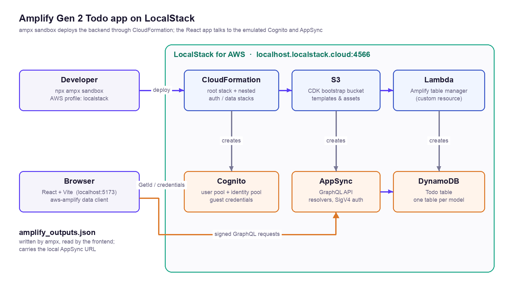
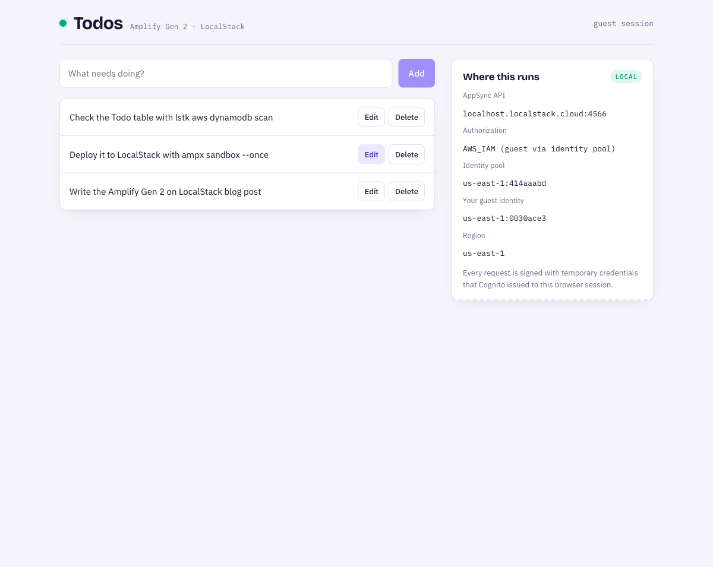

# Amplify Gen 2 Todo App with Cognito, AppSync and DynamoDB on LocalStack

[](https://github.com/localstack-samples/sample-amplify-gen2-todo-app/actions/workflows/integration-test.yml)

| Key          | Value                                                                                  |
| ------------ | -------------------------------------------------------------------------------------- |
| Environment  | LocalStack, AWS                                                                        |
| Services     | Cognito, AppSync, DynamoDB, CloudFormation, S3, Lambda, SSM, IAM                       |
| Integrations | AWS Amplify Gen 2 (`ampx`), AWS CDK, AWS SDK for JavaScript, `lstk`                    |
| Categories   | Serverless, GraphQL, Full-stack web                                                    |
| Level        | Beginner                                                                               |
| Use Case     | Local development of Amplify Gen 2 apps, Sandbox dev loop                              |
| GitHub       | [Repository link](https://github.com/localstack-samples/sample-amplify-gen2-todo-app)  |

## Introduction

This sample deploys an [AWS Amplify Gen 2](https://docs.amplify.aws/) application to LocalStack instead of an AWS account. The backend is the stock `create-amplify` template: a Cognito user pool and identity pool from `defineAuth`, and a `Todo` model from `defineData` that becomes an AppSync GraphQL API backed by a DynamoDB table. Guests (visitors who have not signed in) get temporary credentials from the identity pool and can create, read, update and delete todos. The frontend is a small React + Vite app that lists, adds, edits and deletes todos and shows which endpoints it is talking to.

The point of the sample is the workflow. `npx ampx sandbox`, the Amplify Gen 2 developer sandbox, deploys the backend through CloudFormation to LocalStack, writes `amplify_outputs.json` with the local endpoints, and redeploys on every change under `amplify/`. The same code runs against AWS: deploy an AWS sandbox and start the frontend without the LocalStack mode.

## Architecture

The following diagram shows the architecture that this sample application builds and deploys:



- [Cognito](https://docs.localstack.cloud/aws/services/cognito-idp/) user pool and identity pool for authentication. The app uses the identity pool's guest access to sign requests.
- [AppSync](https://docs.localstack.cloud/aws/services/appsync/) GraphQL API with the generated `createTodo`, `getTodo`, `listTodos`, `updateTodo` and `deleteTodo` operations and their resolvers.
- [DynamoDB](https://docs.localstack.cloud/aws/services/dynamodb/) table for the `Todo` model, created by Amplify's table manager, a [Lambda](https://docs.localstack.cloud/aws/services/lambda/) function deployed as a CloudFormation custom resource.
- [CloudFormation](https://docs.localstack.cloud/aws/services/cloudformation/) root stack with nested stacks for the auth and data categories, deployed by the CDK toolkit embedded in `ampx`.
- [S3](https://docs.localstack.cloud/aws/services/s3/) bucket from the CDK bootstrap for templates and assets, and [SSM](https://docs.localstack.cloud/aws/services/ssm/) parameters for Amplify's bookkeeping.

## Prerequisites

- A valid [LocalStack for AWS license](https://localstack.cloud/pricing). Your license provides a [`LOCALSTACK_AUTH_TOKEN`](https://docs.localstack.cloud/aws/getting-started/auth-token/) to activate LocalStack. Cognito and AppSync require a licensed plan.
- [`lstk` CLI](https://docs.localstack.cloud/aws/developer-tools/running-localstack/lstk/) 1.0 or later.
- [Docker](https://docs.docker.com/get-docker/).
- [Node.js](https://nodejs.org/) 22.12 or later. The frontend uses Vite 8, which needs it.
- The [AWS CDK CLI](https://docs.aws.amazon.com/cdk/v2/guide/getting-started.html) (`npm install -g aws-cdk`), which `lstk cdk` wraps.
- [`make`](https://www.gnu.org/software/make/) for running the sample application via the provided Makefile.

## Installation

To run the sample application, you need to install the required dependencies.

First, clone the repository:

```shell
git clone https://github.com/localstack-samples/sample-amplify-gen2-todo-app.git
```

Then, navigate to the project directory:

```shell
cd sample-amplify-gen2-todo-app
```

Install the dependencies:

```shell
make install
```

## Deployment

Start LocalStack. The Makefile passes two settings: `LOCALSTACK_EXTRA_CORS_ALLOWED_ORIGINS=http://localhost:5173` so the browser can call Cognito and AppSync from the Vite dev server's origin, and `LOCALSTACK_LAMBDA_IGNORE_ARCHITECTURE=1` because Amplify pins one of its CloudFormation helper functions to `arm64`, which this setting runs natively on x86_64 hosts as well:

```shell
export LOCALSTACK_AUTH_TOKEN=<your-auth-token>
make start
```

`ampx` deploys with an AWS profile. Write the `localstack` profile once:

```shell
make setup
```

Deploy the backend. This bootstraps the CDK toolkit stack in LocalStack and runs `npx ampx sandbox --once --identifier local --profile localstack`:

```shell
make deploy
```

The output ends with the local AppSync endpoint and the generated outputs file:

```shell
✔ Deployment completed in 55.307 seconds
AppSync API endpoint = http://localhost.localstack.cloud:4566/graphql/4f77b9c21fa740f885cfdc9594
File written: amplify_outputs.json
```

Run the frontend against LocalStack:

```shell
make run
```

Open [http://localhost:5173](http://localhost:5173) and add a few todos. The panel on the right shows the AppSync host, the identity pool and the guest identity Cognito issued to your browser session.



## Testing

Run the end-to-end test against the deployed backend. It obtains guest credentials from the identity pool and runs the Todo operations through AppSync with the Amplify data client, the same way the frontend does:

```shell
make test
```

```shell
  data.url        = http://localhost.localstack.cloud:4566/graphql/4f77b9c21fa740f885cfdc9594
  identity pool   = us-east-1:7fd216cc
  guest identity  = us-east-1:5b1c2d3e
  PASS  guest credentials issued
  PASS  createTodo returns id and content
  PASS  getTodo reads the item back
  PASS  listTodos contains the item
  PASS  updateTodo returns the new content
  PASS  listTodos filter matches the new content
  PASS  updateTodo on a missing id fails
  PASS  deleteTodo returns the id
  PASS  getTodo after delete returns null

All checks passed
```

The [GitHub Actions workflow](.github/workflows/integration-test.yml) runs the same deployment and test on every push.

## Use Cases

### Amplify Gen 2 sandbox on LocalStack

`ampx sandbox` is Amplify's per-developer dev loop: it synthesizes the backend with CDK, deploys it through CloudFormation, and redeploys on every file save. Everything `ampx` does goes through the AWS SDK for JavaScript v3, which resolves endpoints from the AWS profile, so `--profile localstack` is all it takes to deploy to LocalStack. `make sandbox` runs it in watch mode; edit `amplify/data/resource.ts` (for example, add `isDone: a.boolean()` to the `Todo` model) and the change is hotswapped into the running AppSync API in a few seconds.

Two details make the flow work:

- The CDK toolkit uploads assets with the bucket name in the hostname. LocalStack recognises those requests as S3 on `s3.localhost.localstack.cloud`, so the Makefile sets `AWS_ENDPOINT_URL_S3=http://s3.localhost.localstack.cloud:4566` for `ampx`.
- LocalStack starts from a clean state, while the CDK toolkit keeps a hotswap cache under `.amplify/`. `scripts/reset-cdk-cache.mjs` drops that cache before a deploy, so a restarted LocalStack always gets a full deployment.

### Pointing the Amplify client at LocalStack

`amplify_outputs.json` carries the AppSync URL, so the data layer needs nothing extra. Cognito endpoints are derived from the Region inside the Amplify library and have no field in the outputs file, so [`src/amplify-config.ts`](src/amplify-config.ts) adds `userPoolEndpoint` and `identityPoolEndpoint` when `VITE_LOCALSTACK_ENDPOINT` is set. `make run` starts Vite in the `localstack` mode, which loads [`.env.localstack`](.env.localstack); plain `npm run dev` leaves the endpoints alone and the app talks to AWS.

### Inspecting the deployment

```shell
lstk status                                                # every resource ampx created
lstk aws cloudformation list-stacks --query 'StackSummaries[].StackName'
lstk aws appsync list-graphql-apis
lstk aws dynamodb scan --table-name <Todo-...>             # the todos, with createdAt/updatedAt/__typename
lstk logs --follow                                         # requests as you click around
```

The [LocalStack Web App](https://app.localstack.cloud/inst/default/resources) shows the same resources in its Resource Browser.

## Cleanup

Delete the sandbox stack and stop LocalStack:

```shell
make destroy
make stop
```

## Summary

This sample demonstrates how to:

- Deploy an Amplify Gen 2 backend (Cognito, AppSync, DynamoDB) to LocalStack with the standard `ampx sandbox` command and an AWS profile.
- Run the Amplify sandbox dev loop, including hotswapped schema changes, against a local container.
- Point the `aws-amplify` client library at LocalStack with a single override for the Cognito endpoints.
- Test the deployed API end to end with guest credentials, locally and in CI.

## Learn more

- [Amplify Gen 2 documentation](https://docs.amplify.aws/)
- [LocalStack Cognito](https://docs.localstack.cloud/aws/services/cognito-idp/), [AppSync](https://docs.localstack.cloud/aws/services/appsync/) and [DynamoDB](https://docs.localstack.cloud/aws/services/dynamodb/) documentation
- [`lstk` CLI](https://docs.localstack.cloud/aws/developer-tools/running-localstack/lstk/)

## Contributing

We appreciate your interest in contributing to our project and are always looking for new ways to improve the developer experience. We welcome feedback, bug reports, and even feature ideas from the community. Please refer to the [contributing file](CONTRIBUTING.md) for more details on how to get started.

## License

This project is licensed under the Apache License 2.0. See the [LICENSE](LICENSE) file for details.
